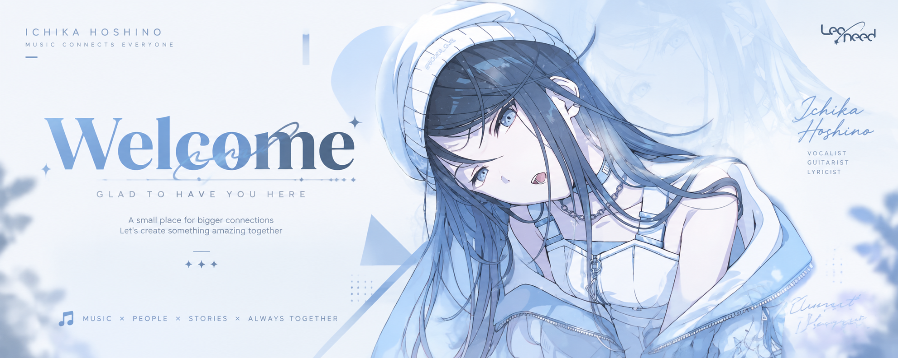
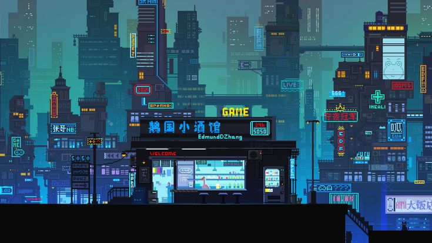

# tiraq-official

<div align="center">



</div>

<br>

<table>
<tr>

<td width="60%" valign="top">

##  About Me

Hi am saptak,a student passionate about **Android Open Source Project (AOSP)**, **Linux**, and **open-source development**.

Currently exploring:

- 📱 Android ROM Development
- 🌳 Device Tree & Kernel Development
- 🐧 Linux customization
- ⚙️ System optimization


<p>


</p>


</td>

<td width="40%" valign="top">



</td>

</tr>
</table>


---

# 🛠 Tech Stack

<div align="center">


<br>


</div>


---

## 🎯 Interests

- 📱 Android ROM Development
- 🌳 Kernel & Device Tree Development
- 🐧 Linux & Open Source
- 🔓 Cybersecurity & Ethical Hacking
- 🎮 Gaming (Sekiro, Genshin Impact)
- 🏎️ Formula 1 & Rally Racing
- 🎵 Soft Music
- 📸 Photography

---

# 🏎 Formula 1

Big Formula 1 enthusiast.

Favourite drivers:

🇬🇧 **Lewis Hamilton**  
🇳🇱 **Max Verstappen**  
🇲🇨 **Charles Leclerc**


---

# 💻 Current Setup

**System Specs**
* **OS:** Arch Linux (Kernel 7.1.11-arch1)
* **WM / Compositor:** Hyprland v0.56.2
* **Shell:** Fish v4.8.1
* **CPU:** Intel Core i5-14600K (14 Cores / 20 Threads @ 5.3 GHz)
* **GPU:** Intel UHD Graphics 770
* **Memory:** 16 GiB RAM + 4 GiB zram swap
* **Storage:** 500GB Western Digital Blue SN5100 NVMe SSD (Btrfs)
* **Motherboard:** Gigabyte B760M E

---

# 🌐 Connect

<p>

<a href="https://t.me/lost_traveller">

</a>

</p>


---

<div align="center">

```
Music • Code • Linux • Open Source
```

⚡ *Still learning. Still breaking things. Still building.*

</div>