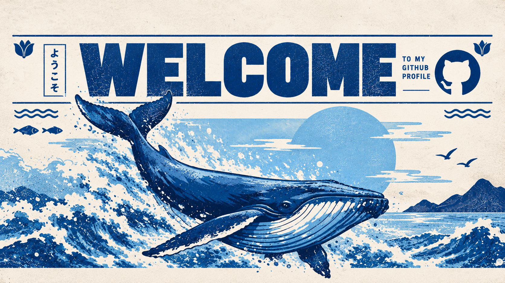

<div align="center">



#  Hey there!

**saptak** aka **tiraq** · student · India 

**Android ROM dev · Linux ricer · Kernel tinkerer · Security enthusiast**

*Still learning. Still breaking things. Still building.*

</div>

---

##  Environment Stack

<div align="center">


</div>

---

##  What I Do

- <b>Android ROM development</b> — building device trees and shipping ROMs
- <b>Kernel customization</b> — tweaking, building and breaking kernels
- <b>Linux customization</b> — ricing my daily driver (see Arsenal below)
- <b>Security research & ethical hacking</b> — figuring out how things break 

---

## 📊 GitHub Stats

<div align="center">


<br>


<br>


<br>

<picture>
  <source media="(prefers-color-scheme: dark)" srcset="https://raw.githubusercontent.com/tiraq-official/tiraq-official/output/github-contribution-grid-snake-dark.svg" />
  
</picture>

</div>

---

##  Beyond the Code

##  Music

<table>
  <tr>
    <td valign="top">
      
    </td>
    <td valign="top">

### Favorite Artists:

**Shreya Ghoshal** • **Arijit Singh** • **Atif Aslam** • **TheFatRat** • **Zutomayo**

    </td>
  </tr>
</table>

##  Racing

<table>
  <tr>
    <td valign="top">
      
    </td>
    <td valign="top">

### Favorite drivers:

🇬🇧 **Lewis Hamilton** • 🇳🇱 **Max Verstappen** • 🇲🇨 **Charles Leclerc**

    </td>
  </tr>
</table>

---

## Arsenal 

| | |
|:---|:---|
| **OS** | Arch Linux · Kernel 7.1.11-arch1 |
| **WM** | Hyprland v0.56.2 |
| **Shell** | Fish v4.8.1 |
| **CPU** | Intel Core i5-14600K · 14C/20T · 5.3 GHz |
| **GPU** | Intel UHD Graphics 770 |
| **Memory** | 16 GiB RAM + 4 GiB zram |
| **Storage** | 500 GB WD Blue SN5100 NVMe · Btrfs |

---

##  Find Me

<div align="center">

<a href="https://t.me/lost_traveller">
  
</a>

</div>

---

<div align="center">

```
Music • Code • Linux • Open Source
```

</div>
